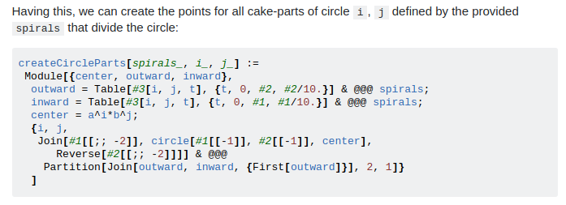
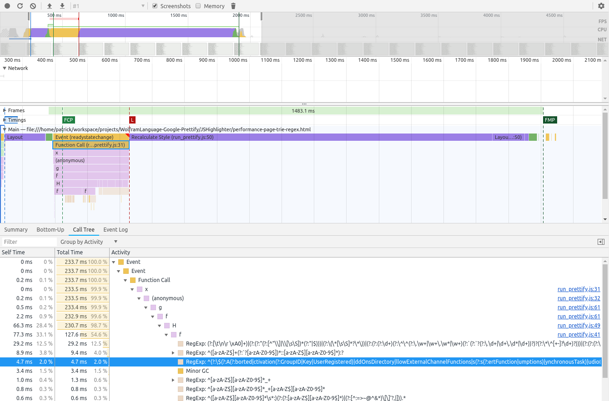

# Wolfram Language support for the Google Code Prettify
 
This is the official code highlighter for [Mathematica.stackexchange.com](http://mathematica.stackexchange.com/)
and [the Wolfram Community](http://community.wolfram.com). It provides the syntax specification
for the Wolfram Language required to highlight code with the [Google code prettifier](https://github.com/google/code-prettify). Here is a highlighted example from StackExchange:

> 

## Usage

To use it with your installation of [google-code-prettify](https://github.com/google/code-prettify), you have to add the minified JavaScript language definition `lang-mma.min.js` from the `JSHighlighter` directory to your code-prettify installation.
Another way is to load the Wolfram Language highlighter after code-prettify in your HTML code.
The `JSHighlighter` directory contains an `index.html` that [shows how it works](https://halirutan.github.io/WolframLanguage-Google-Prettify/JSHighlighter/index.html).
Further information can be found in the [google-code-prettify repository](https://github.com/google/code-prettify).

## Building and Development

The Wolfram Language highlighting script is created from the `JSHighlighter/lang-mma-TEMPLATE.js` template by inserting
regexes for Mathematica built-in symbols and named characters.
This can be done entirely from within Mathematica by using the provided package:

```mma
PacletDirectoryAdd["/YourPath/WolframLanguage-Google-Prettify/WLSource/SymbolInformation"];
<< SymbolInformation`

buildJavaScriptTrieRegex[]
(* or *)
buildJavaScriptAlternativeRegex[]
```

It's vital to leave the `SymbolInformation` package in the repository directory (aka don't install it) because it relies
on the relative path to find the correct `JSHighlighter` directory. Alternatively, you can provide the path to
`lang-mma-TEMPLATE.js` as an argument to the two functions. The difference between the two building methods is

- `buildJavaScriptAlternativeRegex[]` takes the list of Mathematica's built-in symbols and creates a regex using the alternative pattern. Therefore, the list of symbols `{"Names", "NamespaceBox", "NamespaceBoxOptions"}` becomes the regex 
`(:?Names|NamespaceBox|NamespaceBoxOptions)` which is then inserted in the template JavaScript. This approach was used in former versions of the highlighter.
- `buildJavaScriptTrieRegex[]` takes the list of Mathematica's built-in symbols and builds a 
[Trie](https://en.wikipedia.org/wiki/Trie) which should *in theory* improve the performance of matching symbols. Therefore, the list of symbols `{"Names", "NamespaceBox", "NamespaceBoxOptions"}` becomes a regex of the form `Names(?:paceBox(?:Options)?)?`.

It's up to you, which version you want to use and I have set up two performance test-pages which display all 7000 Mathematica
symbols and 7000 dictionary words (as negative examples) to profile the matching speed.
The vast majority of the time is not spent in the matching though and if my not entirely mistaken with my non-existent JavaScript
profiling knowledge, only 4.7ms of 1483ms is spent in the actual regex:

[](profiling.png)

Surprisingly, the `(:?Names|NamespaceBox|NamespaceBoxOptions)` alternative pattern is 1ms faster.
This difference is not noticeable and since the `lang-mma.min.js` Trie version (88kB) is much smaller than the alternative pattern
`lang-mma-alternative-regex.min.js` (127kB), I would suggest to use the Trie version. However, if readability counts because
you want to check easily if a symbol is included in the regex, then the alternative pattern version is to be preferred.
You can perform your own performance tests by using

- [this page](https://halirutan.github.io/WolframLanguage-Google-Prettify/JSHighlighter/performance-page-trie-regex.html) for testing the Trie version of the regex
- [this page](https://halirutan.github.io/WolframLanguage-Google-Prettify/JSHighlighter/performance-page-alternative-regex.html) for using the alternative pattern version of the regex

### Repository Structure

- `JSHighlighter` directory contains the template JavaScript files, the final syntax highlighter scripts and their minified versions, CSS definitions for StackExchange code colors, and example HTML pages.
- `WLSource` contains the `SymbolInformation` Mathematica package to extract built-in symbols and named characters and build the final highlighter scripts. To build a Trie from a list of words, the `SymbolInformation` package uses `JLink` code which is provided as a `jar` in the `Java` subdirectory. This jar is built from ...
- ... the `KotlinSource` which contains a small `PrefixTree.kt` for building a Trie and turning it into a regex. Additionally,
this directory contains test-code for profiling the matching speed.

The `SymbolInformation` package exposes some additional functions.
You can e.g. create a Trie regex from a list of words:

```mma
l = Names["Plot*"];
createTrieRegex[l]

(* "Plot(?:3(?:D|Matrix)|Division|Joined|L(?:a(?:bel(?:s)?|yout)|egends)|Markers|Points|R(?:ange(?:Clip(?:PlanesStyle|ping)|Padding)?|egion)|Style|Theme)?" *)
```